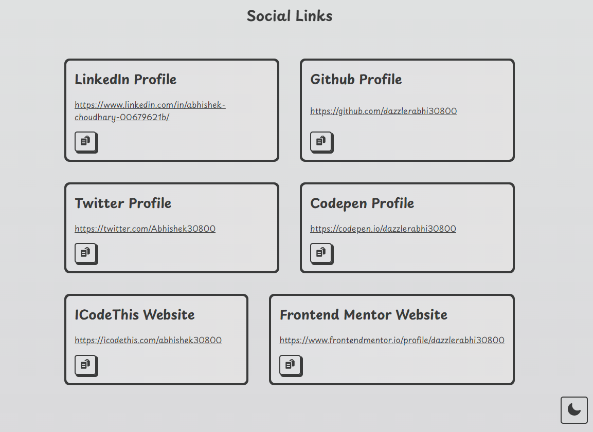
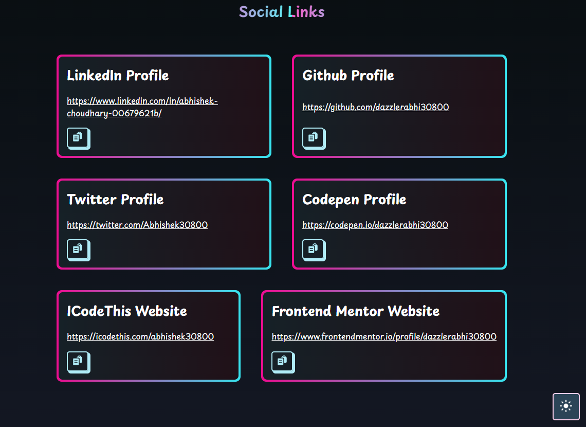

# Link Portfolio

This is Link Portfolio is collection of all my useful links as it's very repeating to copy or bookmark a link. So that was the my idea for designing this website.

## Tech Stack 
- Next.js
- Typscript
- Heroicons(for icons) 

## How to run
1. Fork or clone the repository & then in the root director run command ```npm install``` wait for it to complete.
2. Then run ```npm run dev``` that will start the server;

## Live Preview [Live Site](https://next-js-useful-links.vercel.app/)

## Preview
### Light Mode



### Dark Mode
